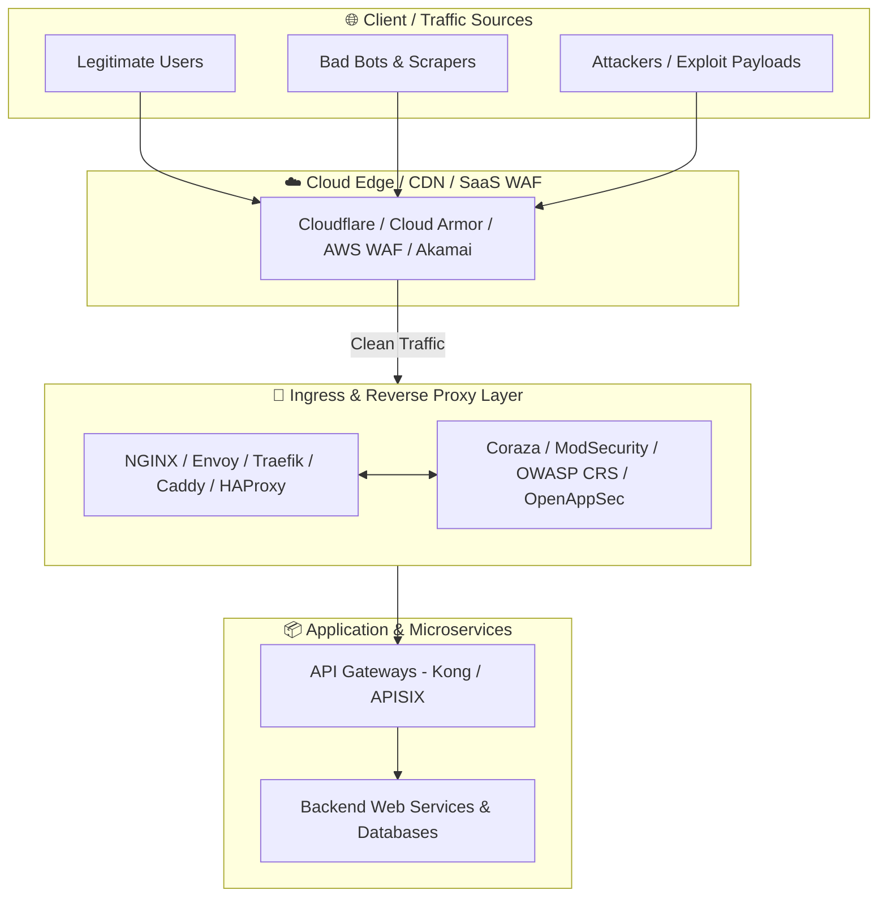

  

# 🛡️ Awesome Web Application Firewall (WAF) & WAAP Matrix

  
  
  
  
  
  
  
  

---

## 🌟 Overview & Market Landscape

A **Web Application Firewall (WAF)** and **Web Application & API Protection (WAAP)** suite monitors, inspects, and filters incoming HTTP/HTTPS/gRPC traffic destined for web applications, web services, and APIs. WAFs safeguard internet-facing assets against **OWASP Top 10 vulnerabilities** (such as SQL Injection, Cross-Site Scripting (XSS), Remote Code Execution (RCE), SSRF, Broken Access Control), zero-day exploits, malicious bots, Layer 7 DDoS floods, and automated abuse.

This curated matrix provides an **in-depth comparison** of enterprise SaaS/Hosted WAAP solutions sorted by organizational valuation/scale and open-source WAF engines ranked by community adoption.

---

## 📑 Table of Contents

- [🏢 SaaS & Hosted WAAP Platforms](#-saas--hosted-waap-platforms)
- [💻 Open-Source GitHub Projects](#-open-source-github-projects)
- [🧩 Architecture & Deployment Models](#-architecture--deployment-models)
- [🛡️ Key Threat Vectors Mitigated](#️-key-threat-vectors-mitigated)
- [📈 Star History](#-star-history)
- [🤝 How to Contribute](#-how-to-contribute)
- [⚖️ Disclaimer](#️-disclaimer)

---

## 🏢 SaaS & Hosted WAAP Platforms

The following hosted and managed cloud WAAP platforms are sorted in descending order by parent company scale (market capitalization / valuation / annual revenue).

| 🏢 Product | 📊 Company Valuation / Scale | 📝 Description | 💳 Pricing (Starting Tier) | 🎁 Free Tier / Trial Limits |
| :--- | :--- | :--- | :--- | :--- |
| **[Azure Web Application Firewall](https://azure.microsoft.com/products/web-application-firewall)** | **~$3.1 Trillion Market Cap** *(Microsoft - ~$245B Rev)* | Native cloud WAF integrated with Azure Application Gateway & Front Door, delivering managed OWASP rules and custom bot protection policies. | $5.00/month per WAF policy + ~$0.448/hour (~$327/month) Application Gateway v2 base fee + $0.0144/hour/CU | 30-day free trial with $200 in Microsoft Azure trial credits |
| **[Google Cloud Armor](https://cloud.google.com/armor)** | **~$2.1 Trillion Market Cap** *(Alphabet - ~$350B Rev)* | Google Cloud edge security service providing ML-driven Layer 7 filtering, DDoS protection, adaptive rate limiting, and pre-configured OWASP rule sets. | Standard: $5.00/month per security policy + $1.00/month per rule + $0.75 per 1M requests; Enterprise: $3,000/month | 90-day free trial with $300 in Google Cloud Platform credits |
| **[AWS WAF](https://aws.amazon.com/waf/)** | **~$1.9 Trillion Market Cap** *(Amazon - ~$600B Rev)* | Managed cloud WAF tightly coupled with Amazon CloudFront, ALB, API Gateway, and AppSync with AWS Managed Rules and automated threat detection. | $5.00/month per Web ACL + $1.00/month per rule + $0.60 per 1M requests (prorated hourly) | 30-day free trial with 10,000,000 requests processed per month for AWS WAF Bot Control |
| **[Oracle Cloud WAF](https://www.oracle.com/security/cloud-security/web-application-firewall/)** | **~$380 Billion Market Cap** *(Oracle - ~$53B Rev)* | Enterprise cloud WAF service providing bot management, access controls, rate limiting, and Layer 7 protection across OCI and multi-cloud endpoints. | $5.00/month per rule set + $0.60 per 1M requests + $0.0015/GB outbound data transfer | 30-day free trial with $300 in Oracle Cloud Infrastructure credits |
| **[Alibaba Cloud WAF](https://www.alibabacloud.com/product/web-application-firewall)** | **~$210 Billion Market Cap** *(Alibaba Group - ~$130B Rev)* | AI-powered Web Application Firewall featuring automated threat modeling, bot mitigation, API security inspection, and compliance auditing. | Basic plan starts at ~$140/month; Pay-As-You-Go starts at $0.01 per SeCU (~$50/month base) | 30-day free trial with Alibaba Cloud free trial credits |
| **[Fortinet FortiWeb](https://www.fortinet.com/products/web-application-firewall)** | **~$55 Billion Market Cap** *(Fortinet - ~$5.3B Rev)* | AI-powered WAAP protecting web apps and APIs against OWASP Top 10 vulnerabilities, automated bots, and zero-day threats via cloud or appliances. | FortiWeb Cloud starts at $0.04/hour or ~$20/month per web app via consumption points | 14-day to 30-day free trial on AWS, Azure, and GCP marketplaces |
| **[Imperva](https://www.imperva.com/)** | **~$35 Billion Market Cap** *(Thales Group / $3.6B Acquisition)* | Comprehensive enterprise WAAP platform featuring market-leading WAF, Advanced Bot Protection, DDoS mitigation, API discovery, and RASP defense. | Cloud WAF entry plans start at ~$59/month (Pro) and ~$299/month (Business); Enterprise custom quotes | 30-day free trial with full access to Cloud WAF and Login Protect features |
| **[Cloudflare WAF](https://www.cloudflare.com/application-services/products/waf/)** | **~$30 Billion Market Cap** *(Cloudflare - ~$1.6B Rev)* | Global edge WAAP platform providing machine learning threat scoring, managed OWASP rulesets, zero-day virtual patching, and bot management. | Free tier available ($0); Pro tier starts at $20/month (billed annually) or $25/month (monthly); Business tier at $200/month | Free forever plan includes unmetered DDoS mitigation and up to 5 custom firewall rules per domain |
| **[Sucuri Website Firewall](https://sucuri.net/website-firewall/)** | **~$24 Billion Market Cap** *(GoDaddy - ~$4.3B Rev)* | Cloud-based website security solution and WAF offering malware removal, virtual patching, Layer 7 DDoS filtering, and CDN acceleration. | Basic plan starts at $9.99/month ($119.88/year); Pro plan at $19.98/month ($239.88/year) | 30-day free trial with full WAF protection and malware scanning for 1 website |
| **[Check Point CloudGuard WAF](https://www.checkpoint.com/cloudguard/cloudguard-waf/)** | **~$22 Billion Market Cap** *(Check Point - ~$2.5B Rev)* | Context-aware AI-driven WAF and API security engine that minimizes false positives with automated learning and real-time prevention. | Pay-As-You-Go starts at ~$0.024/hour (~$17.50/month) or ~$299/month on cloud marketplaces | 30-day free trial on AWS Marketplace and Check Point Infinity Portal |
| **[Citrix Web App & API Protection](https://www.netscaler.com/)** | **~$16.5 Billion Valuation** *(Cloud Software Group - ~$3.2B Rev)* | Layer 7 security architecture combining NetScaler AppExpert WAF engine, bot management, API protection, and DDoS mitigation. | Starts at ~$0.40/hour on AWS/Azure Marketplace (~$290/month) or pooled licenses from ~$3,000/year | 90-day free trial for NetScaler VPX Express / 30-day trial on cloud marketplaces |
| **[Akamai App & API Protector](https://www.akamai.com/products/app-and-api-protector)** | **~$14 Billion Market Cap** *(Akamai - ~$3.9B Rev)* | Industry-leading edge WAAP solution combining adaptive security rules, automated attack detection, machine-learning bot intelligence, and API security. | Enterprise annual contract starting at ~$2,000/month based on traffic volume and protected domains | 30-day proof-of-concept (POC) / evaluation trial via Akamai enterprise sales |
| **[Akamai Kona Site Defender](https://www.akamai.com/)** | **~$14 Billion Market Cap** *(Akamai - ~$3.9B Rev)* | High-capacity edge protection platform engineered to absorb massive DDoS floods while inspecting application traffic against sophisticated web attacks. | Enterprise contract starting at ~$3,000/month based on protected applications and edge capacity | 30-day guided evaluation trial via Akamai enterprise sales |
| **[F5 Distributed Cloud WAAP](https://www.f5.com/cloud)** | **~$12 Billion Market Cap** *(F5, Inc. - ~$2.8B Rev)* | SaaS-delivered multi-cloud application protection consolidating WAF, behavioral AI bot defense, API discovery, and DDoS mitigation into one control plane. | AWS Marketplace PAYG starts at ~$3.704/hour (~$2,700/month); Subscription packages start at ~$500/month | 45-day free trial for enterprise evaluation via F5 Distributed Cloud console |
| **[F5 BIG-IP Advanced WAF](https://www.f5.com/products/security/web-application-firewall)** | **~$12 Billion Market Cap** *(F5, Inc. - ~$2.8B Rev)* | Enterprise-grade WAF appliance and virtual edition offering behavioral analytics, credential-stuffing protection, and layer-7 encrypted attack inspection. | Starts at ~$1.96/hour on AWS/Azure Marketplace (~$1,430/month) or perpetual license from ~$4,000/instance | 30-day free trial on AWS and Azure marketplaces with all WAF modules enabled |
| **[Barracuda WAF](https://www.barracuda.com/products/application-protection/web-application-firewall)** | **~$3.8 Billion Valuation** *(KKR Portfolio - ~$500M Rev)* | CloudGen WAF and WAF-as-a-Service providing automated protection against web exploits, DDoS, malicious bots, and unauthenticated API calls. | PAYG starts at ~$1.19/hour on AWS Marketplace; Cloud-delivered WAF starts at ~$199/month | 30-day free trial on AWS/Azure Marketplace with full feature access |
| **[Fastly Next-Gen WAF](https://www.fastly.com/products/next-gen-waf)** | **~$1.2 Billion Market Cap** *(Fastly - ~$520M Rev)* | Next-Gen WAF powered by Signal Sciences threshold-based inspection, deployed at edge, container, proxy, or web server levels without breaking apps. | Starts at ~$2,000/month (annual contract based on deployment model and request volume) | 30-day proof-of-concept (POC) trial environment via enterprise sales engagement |
| **[A10 Networks WAF](https://www.a10networks.com/products/application-delivery-controller/)** | **~$1.1 Billion Market Cap** *(A10 Networks - ~$260M Rev)* | Integrated application delivery and WAF platform providing deep packet inspection, OWASP mitigation, and SSL/TLS acceleration for enterprise networks. | Starts at ~$0.80/hour on AWS Marketplace (~$584/month) or perpetual appliance/virtual licensing | 30-day free trial on AWS Marketplace |
| **[Radware Cloud WAF](https://www.radware.com/cybersecurity/application-security/web-application-firewall/)** | **~$1.0 Billion Market Cap** *(Radware - ~$280M Rev)* | Fully managed cloud WAAP providing auto-policy generation, behavioral threat detection, bot management, API security, and 24/7 SOC defense. | Starting at ~$1,000/month for entry-level managed cloud WAF service | 30-day free trial for enterprise evaluation with full managed WAF capabilities |
| **[StackPath WAF](https://www.stackpath.com/)** | **Defunct / Liquidated** *(Operations Ceased June 2024)* | Former edge security and application delivery platform with built-in Layer 7 traffic-filtering capabilities. | Discontinued (Operations ceased June 2024; historically started at $10.00/month) | Discontinued (Historically offered 30-day free trial with 1M requests/month) |

---

## 💻 Open-Source GitHub Projects

The following open-source WAF engines, security proxies, API gateways, intrusion-prevention tools, and rule sets are **sorted in descending order by GitHub Stars ⭐**.

1. **[Caddy](https://github.com/caddyserver/caddy)**   
   ⚡ Fast, extensible multi-platform HTTP/1-2-3 web server with automatic HTTPS by default and a rich modular middleware architecture suitable for custom WAF and security proxy setups.

2. **[Traefik](https://github.com/traefik/traefik)**   
   🚀 Leading cloud-native reverse proxy and Kubernetes ingress controller that integrates middleware for rate limiting, security headers, authentication, and custom traffic inspection.

3. **[Kong](https://github.com/Kong/kong)**   
   🦍 Cloud-native API gateway and reverse proxy offering authentication, IP restriction, bot detection, rate limiting, request validation, and plugin-based security enforcement.

4. **[Istio](https://github.com/istio/istio)**   
   🌐 Open-source service mesh built on Envoy proxy providing zero-trust mTLS encryption, authorization policies, traffic management, and security inspection for microservices and APIs.

5. **[NGINX](https://github.com/nginx/nginx)**   
   🏎️ High-performance HTTP server, reverse proxy, and load balancer that serves as the bedrock for ModSecurity, NAXSI, OpenAppSec, and custom enterprise WAF architectures.

6. **[Envoy Proxy](https://github.com/envoyproxy/envoy)**   
   🛰️ High-performance C++ distributed proxy designed for cloud-native architectures, serving as the core engine for service meshes, API gateways, and Proxy-WASM WAF filters.

7. **[SafeLine](https://github.com/chaitin/SafeLine)**   
   🛡️ User-friendly, self-hosted Web Application Firewall powered by semantic attack-detection algorithms and an intuitive management dashboard for rapid on-premise protection.

8. **[Fail2Ban](https://github.com/fail2ban/fail2ban)**   
   🚫 Daemon that inspects application logs for malicious patterns (brute force, repeated exploits, unauthorized probes) and dynamically updates firewall rules to ban offenders.

9. **[Apache APISIX](https://github.com/apache/apisix)**   
   🔥 Dynamic, real-time, high-performance API gateway providing out-of-the-box plugins for traffic defense, rate limiting, token bucket controls, and API security policies.

10. **[CrowdSec](https://github.com/crowdsecurity/crowdsec)**   
    👥 Modern collaborative threat detection engine that analyzes behavior across servers and shares verified attacker IP intelligence globally to block malicious IPs in real time.

11. **[OpenResty](https://github.com/openresty/openresty)**   
    🌙 Full-fledged web platform integrating NGINX core with LuaJIT to construct ultra-fast, highly customizable, programmable WAF filters, API gateways, and security proxies.

12. **[BunkerWeb](https://github.com/bunkerity/bunkerweb)**   
    🔒 Open-source, containerized Web Application Firewall based on NGINX and ModSecurity, designed to integrate seamlessly into Docker, Swarm, and Kubernetes environments.

13. **[ModSecurity](https://github.com/owasp-modsecurity/ModSecurity)**   
    🏛️ The industry standard open-source WAF engine (v2 / v3 libmodsecurity) providing rich SecLang rule parsing and real-time HTTP traffic inspection across NGINX and Apache.

14. **[Maltrail](https://github.com/stamparm/maltrail)**   
    🚨 Malicious traffic detection system utilizing publicly available blacklists, heuristic algorithms, and threat feeds to identify suspicious web requests and network anomalies.

15. **[HAProxy](https://github.com/haproxy/haproxy)**   
    ⚖️ Reliable, high-performance TCP/HTTP load balancer and proxy with powerful ACL mechanisms, Lua scripting, SPOE (Stream Processing Offload Engine), and request filtering.

16. **[NAXSI](https://github.com/nbs-system/naxsi)**   
    🎯 High-performance, low-maintenance WAF module for NGINX utilizing a positive-security (scoring-based) model rather than signature blacklists to block web attacks.

17. **[Nginx Ultimate Bad Bot Blocker](https://github.com/mitchellkrogza/nginx-ultimate-bad-bot-blocker)**   
    🤖 Extensively maintained NGINX configuration and rule collection to block malicious bots, spam referrers, scanners, scrapers, and abusive web user agents automatically.

18. **[Apache HTTP Server](https://github.com/apache/httpd)**   
    🪶 Robust open-source web server with deep ModSecurity integration (`mod_security2`), access control rules, URL rewriting, and modular security filtering.

19. **[Lua-Nginx-WAF](https://github.com/loveshell/ngx_lua_waf)**   
    🧩 Lightweight, high-speed Lua-based WAF script for NGINX/OpenResty environments offering cookie filtering, POST argument inspection, and IP blacklisting.

20. **[Coraza WAF](https://github.com/corazawaf/coraza)**   
    🐹 Enterprise-grade, cloud-native Go-based WAF library 100% compatible with OWASP CRS and SecLang, ready for integration into Caddy, Traefik, Envoy, and HAProxy.

21. **[OWASP Core Rule Set (CRS)](https://github.com/coreruleset/coreruleset)**   
    📚 The gold-standard collection of generic attack-detection rules for ModSecurity and Coraza, providing baseline protection against the entire OWASP Top 10 with anomaly scoring.

22. **[OpenAppSec](https://github.com/openappsec/openappsec)**   
    🧠 Machine-learning-based application and API security engine that operates within NGINX and Envoy to prevent OWASP Top 10 and 0-day exploits without signature tuning.

23. **[Lua-Resty-WAF](https://github.com/p0pr0ck5/lua-resty-waf)**   
    ⚙️ High-performance WAF built on the OpenResty stack, utilizing non-blocking socket operations and flexible rule definitions for rapid request inspection.

24. **[Wallarm API Firewall](https://github.com/wallarm/api-firewall)**   
    🛡️ Ultra-fast, lightweight API proxy firewall written in Go that validates incoming requests and outgoing responses against OpenAPI (Swagger) specifications in real time.

25. **[Caddy CrowdSec Bouncer](https://github.com/hslatman/caddy-crowdsec-bouncer)**   
    🔌 Native Caddy module that consumes CrowdSec remediation decisions to block or challenge malicious traffic directly inside the Caddy web server.

26. **[Shadow Daemon](https://github.com/zecure/shadowd)**   
    🔍 Modular application firewall combining internal web server hooks with a centralized analysis server to detect and block web injection attacks.

27. **[IronBee](https://github.com/ironbee/ironbee)**   
    🐝 Universal web application security sensor framework designed for real-time traffic monitoring, analysis, and protocol-level enforcement.

28. **[Coraza Proxy-WASM](https://github.com/corazawaf/coraza-proxy-wasm)**   
    🧱 WebAssembly extension of Coraza WAF built for seamless integration into Envoy, Istio Service Mesh, and any Proxy-WASM compliant gateway.

---

## 🧩 Architecture & Deployment Models

Selecting the right WAF architecture depends on your operational priorities (latency, infrastructure control, compliance, and budget):

### 1. ☁️ Cloud Edge / SaaS WAAP
*   **Examples**: Cloudflare WAF, AWS WAF, Google Cloud Armor, Azure WAF, Fastly Next-Gen WAF.
*   **Pros**: Zero infrastructure maintenance, absorbs massive volumetric DDoS attacks before reaching your origin, automatic global threat intelligence updates.
*   **Best for**: Public-facing websites, global e-commerce, multi-cloud setups.

### 2. 🚪 Reverse Proxy / Ingress Controller WAF
*   **Examples**: BunkerWeb, SafeLine, NGINX + ModSecurity + OWASP CRS, Caddy + Coraza.
*   **Pros**: Full data sovereignty, zero external data leakage, custom inspection logic, no recurring request fees.
*   **Best for**: On-premises infrastructure, compliance-regulated environments (HIPAA, PCI-DSS, GDPR), Kubernetes clusters.

### 3. 🕸️ Service Mesh / Proxy-WASM Ingress
*   **Examples**: Istio + Coraza Proxy-WASM, Envoy with OpenAppSec filters.
*   **Pros**: Granular east-west and north-south microservice protection, declarative Kubernetes GitOps management.
*   **Best for**: Cloud-native microservices, zero-trust enterprise Kubernetes environments.

---

## 🛡️ Key Threat Vectors Mitigated

| Threat Vector | Description | Primary Defense Technique |
| :--- | :--- | :--- |
| **💉 SQL Injection (SQLi)** | Attacker injects malicious SQL statements into input forms/headers. | Libinjection, OWASP CRS SecLang regex rules, tokenization. |
| **📜 Cross-Site Scripting (XSS)** | Injected malicious scripts execute inside the victim's web browser. | Contextual HTML/JS encoding verification, payload filtering. |
| **⚡ Remote Code Execution (RCE)** | Unauthenticated shell command injection into backend systems. | System command blacklisting, positive parameter validation. |
| **🔗 Server-Side Request Forgery (SSRF)** | Exploiting backend server to request internal cloud metadata/APIs. | URL/IP destination restriction, loopback & metadata address blocking. |
| **🤖 Malicious Bots & Scraping** | Content scrapers, brute-force bots, automated credential stuffers. | Behavioral fingerprinting, CAPTCHA challenge, IP reputation analysis. |
| **🌊 Layer 7 Application DDoS** | HTTP GET/POST request floods overwhelming application backend CPU/DB. | Token-bucket rate limiting, IP reputation, adaptive ML scoring. |
| **📑 OpenAPI / Schema Violation** | Manipulated payloads bypassing REST/GraphQL schema constraints. | Schema contract enforcement via OpenAPI validation filters. |

---

## 📈 Star History

---

## 🤝 How to Contribute

Contributions are warmly welcomed! Help us keep this guide current and comprehensive:

1. 🍴 **Fork** the repository on GitHub.
2. 🌿 Create a new feature branch (`git checkout -b add-new-waf-entry`).
3. 📝 Add or update entries in `README.md` (ensure pricing, free tier limits, star badges, and links follow the matrix format).
4. 🚀 **Commit** and push your changes (`git commit -m "Add [Tool Name] WAF details"`).
5. 📬 Submit a **Pull Request** with a concise description of your changes.

Check out our central list of curated lists at **[Awesome-Awesome-Awesome](https://github.com/ishandutta2007/Awesome-Awesome-Awesome)**!

---

## ⚖️ Disclaimer

- This repository is a **community-curated index** for informational and educational purposes. Inclusion does not constitute an endorsement.
- SaaS pricing, cloud quotas, and free tier parameters are subject to frequent updates by respective vendors. Always verify with official vendor documentation before making purchasing decisions.
- A reverse proxy or API gateway is an architectural component and may require external modules (e.g. ModSecurity, Coraza, CrowdSec) to function as a full WAF.
- Ensure thorough staging and testing of WAF rules before enabling blocking mode in production to prevent unintended false positives.

---

  <b>Built for Security Engineers, DevSecOps Teams, Cloud Architects &amp; Application Developers.</b> 
  ⭐ <i>Star this repository to stay updated on web application firewall innovations!</i> ⭐

